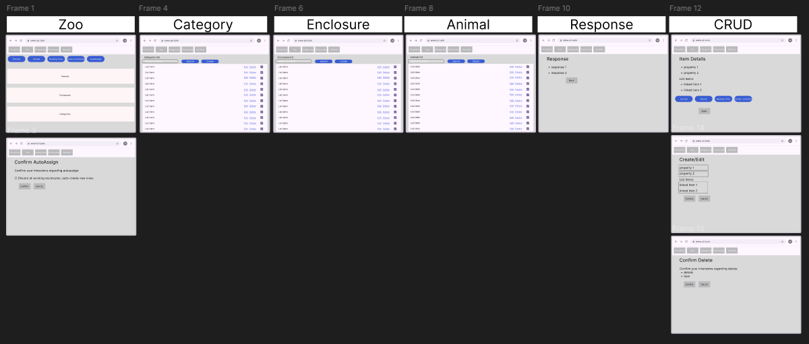
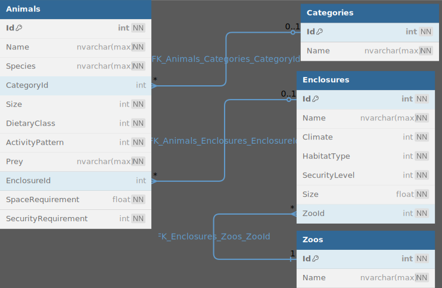

# VirtualZoo Designdocument
C# opdracht: Webapp en API voor een virtuele dierentuin

---

### 1. **Titelpagina**

Projectnaam: VirtualZoo

Auteur: Kento Bergsma

Datum: 28/03/2025

Versie: 1.0

---

### 2. **Inleiding**

#### Korte beschrijving van de applicatie:
VirtualZoo is een webapplicatie waarmee gebruikers een virtuele dierentuin kunnen beheren. De applicatie is gericht op studenten, ontwikkelaars en testers die inzicht willen krijgen in hoe een dierentuin op basis van logica, categorieën en verblijven functioneert. Gebruikers kunnen dieren aanmaken, beheren, koppelen aan verblijven en categorieën, en automatisch een indeling laten maken van dieren over verblijven op basis van vooraf ingestelde regels.

De applicatie is ontwikkeld in het kader van een schoolopdracht voor het vak C#. De opdracht is verstrekt door de opleiding zelf en bevatte concrete eisen zoals CRUD-functionaliteit, een duidelijke projectstructuur met een API en frontend, automatische acties zoals "Feeding Time", en het naleven van best practices binnen ASP.NET Core.

#### Korte uitleg van gekozen technologieën:
Voor de ontwikkeling van VirtualZoo is gekozen voor de volgende technologieën:
* ASP.NET Core (MVC en API)

De applicatie is gestructureerd in twee onderdelen:
* Een ASP.NET Core Web API, waarin alle logica, services, repositories en data operations zijn ondergebracht.
* Een ASP.NET Core MVC WebApp, die fungeert als frontend en via HTTP-aanroepen de API gebruikt om data op te halen en weer te geven.

Entity Framework Core
EF Core is gebruikt voor de communicatie met de SQL Server database. Met behulp van code-first benadering worden de modellen automatisch vertaald naar tabellen, en kunnen relaties zoals one-to-many of many-to-many eenvoudig worden beheerd.

Projectstructuur
Het project is opgesplitst in duidelijke lagen:

* VirtualZooAPI: bevat de controllers, services en repositories.

* VirtualZoo: de frontend met controllers en views.

* VirtualZooShared: gedeelde modellen en enums.

* VirtualZooTests: unittests en integratietests.

---

### 3. **Wireframes**

[Bekijk de wireframes in detail](Docs/Wireframes/VirtualZooWireframes.pdf)

---

### 4. **Entity-Relationship Diagram (ERD)**

---

### 5. **API Documentatie**
Bij Het bouwen van de API heb ik gebruik gemaakt van Swagger. Ik heb geprobeerd zo veel mogelijk Swagger documentatie toe te voegen aan de API. Hieronder vind je een overzicht van de endpoints die beschikbaar zijn in de API. De Swagger documentatie is te vinden door de API op te starten in Visual Studio.

### Animal

##### [GET] /api/animals  
* Haal alle dieren op

##### [POST] /api/animals  
* Voeg een nieuw dier toe

##### [GET] /api/animals/{id}  
* Haal een dier op

##### [PUT] /api/animals/{id}  
* Update een dier

##### [DELETE] /api/animals/{id}  
* Verwijder een dier

##### [GET] /api/animals/{id}/sunrise  
* Geeft aan of het dier wakker wordt bij zonsopgang.

##### [GET] /api/animals/{id}/sunset  
* Geeft aan of het dier wakker wordt bij zonsondergang.

##### [GET] /api/animals/{id}/feedingtime  
* Geeft aan wat het dier eet.

##### [GET] /api/animals/{id}/checkconstraints  
* Controleert of het dier in een geschikt verblijf zit.

### Category

##### [GET] /api/categories  
* Haal alle categorieën op

##### [POST] /api/categories  
* Voeg een nieuwe categorie toe

##### [GET] /api/categories/{id}  
* Haal een categorie op

##### [PUT] /api/categories/{id}  
* Update een categorie

##### [DELETE] /api/categories/{id}  
* Verwijder een categorie

### Enclosure

##### [GET] /api/enclosures  
* Haal alle verblijven op

##### [POST] /api/enclosures  
* Voeg een nieuw verblijf toe

##### [GET] /api/enclosures/{id}  
* Haal een verblijf op

##### [PUT] /api/enclosures/{id}  
* Update een verblijf

##### [DELETE] /api/enclosures/{id}  
* Delete een verblijf

##### [GET] /api/enclosures/{id}/sunrise  
* Geeft aan welke dieren wakker worden of gaan slapen bij zonsopgang.

##### [GET] /api/enclosures/{id}/sunset  
* Geeft aan welke dieren wakker worden of gaan slapen bij zonsondergang.

##### [GET] /api/enclosures/{id}/feedingtime  
* Geeft aan wat elk dier in dit verblijf eet.

##### [GET] /api/enclosures/{id}/checkconstraints  
* Controleert of het verblijf voldoet aan ruimte- en beveiligingseisen.

### Zoo

##### [GET] /api/zoo/sunrise  
* Toont het gedrag van alle dieren bij zonsopgang.

##### [GET] /api/zoo/sunset  
* Toont het gedrag van alle dieren bij zonsondergang.

##### [GET] /api/zoo/feedingtime  
* Toont het dieet van alle dieren.

##### [GET] /api/zoo/checkconstraints  
* Controleert of alle verblijven voldoen aan de eisen van hun dieren.

##### [POST] /api/zoo/autoassign  
* Wijs dieren automatisch toe aan verblijven.

---

### 6. **Reflectie**
- Wat ging goed tijdens het project?
    - Uiteindelijk is het gelukt om vrijwel alle functionaliteiten te implementeren. De API en frontend werken goed samen en de applicatie is goed gestructureerd.
- Wat waren lastige punten?
-   - Tijd. De weekopdrachten en de eindopdracht waren erg groot. Doordat ik de opdracht alleen uitvoerde was het lastig om alles op tijd af te krijgen. 
- Wat heb je geleerd?
    - Ik heb vooral geleerd dat ik interacties met de data goed gescheiden kan houden van de frontend. Dit maakt het makkelijker om de frontend te veranderen zonder dat de backend aangepast hoeft te worden. Ook heb ik geleerd hoe ik een API kan gebruiken om het scheiden makkelijker te maken.
- Wat zou je verbeteren als je meer tijd had?
    - Ik zou de frontend beter verfijnen en aantrekkelijker maken. Daarnaast zou ik functies gebruiksvriendelijker maken.

---

### 7. **Installatie-instructies**

1. Installeer de vereisten:
* .NET 8 SDK
* Visual Studio 2022+ (met ASP.NET en Entity Framework workloads)
* SQL Server (LocalDB)
2. Clone deze repo.
3. Zorg dat je terminal zich in de root van het project bevindt.
4. Open het project en update database `dotnet ef database update --project VirtualZooAPI` 
5. Voer voor de zekerheid het volgende commando uit om de HTTPS certificaten te vertrouwen: `dotnet dev-certs https --trust`
6. Start de app via Visual Studio (Keuze uit de API `VirtualZooAPI` of de frontend `VirtualZoo`)`) of via de termial met `dotnet run --project VirtualZooAPI` of `dotnet run --project VirtualZoo`.
7. de webapplicatie is nu beschikbaar op `https://localhost:7134` en de API op `https://localhost:5001/api/`.

